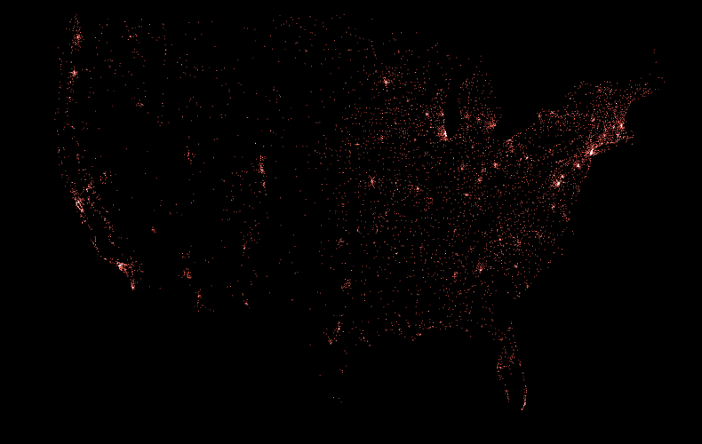

# FarmersMarkets
This is a simple processing project that plots the geographic locations of US farmer markets. It's intended to server as an example of how geo cordinates can be converted to pixel coordinates and vice versa.

